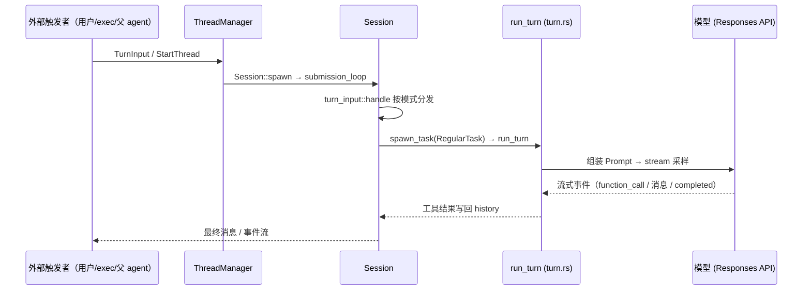

# 01 · Agent 主循环（turn）

> TL;DR：一次「用户消息 → 最终回答」= 一次 turn，内部是「组装上下文 → 调模型 → 执行工具 → 结果回喂」的循环。本页深写 `run_turn`，读完你能说出每一步的代码位置。配套：[02-context-prompt](./02-context-prompt.md)（模型看到什么）、[03-tools](./03-tools.md)（工具怎么执行）。

---

## 1. 职责边界

| 角色 | 负责 | 不负责 |
|---|---|---|
| `ThreadManager` | 创建/恢复/fork 线程 | 不跑 turn 循环 |
| `Session` | 生命周期、`submission_loop` 事件循环、history 记录 | 不决定每轮发什么给模型 |
| `run_turn` | **turn 主循环**：每轮组装 Prompt → 采样 → 处理工具结果 | 不渲染 UI |
| `TurnContext` | turn 的不可变快照（config/model_info/environments/approval_policy，[turn_context.rs:199](../codex-rs/core/src/session/turn_context.rs)） | — |
| `StepContext` | **一次采样请求**的视图（tool_router/environments/model_info） | — |

**对象生命周期**：Session = 进程级（一个线程一个）；TurnContext = turn 级（`turn_context.rs:49` 创建）；StepContext = 采样请求级（`session/mod.rs` 的 `capture_step_context_with_required_mcp_servers`，每轮重建）。

## 2. 调用链（何时被调用）



证据链：

| 环节 | 代码位置 | 作用 |
|---|---|---|
| 输入路由 | `session/turn_input.rs:140` `handle`：`StartOrSteer`/`StartIfIdle`/`Steer` 三分发 | 新 turn 或插入运行中的 turn |
| 任务调度 | `turn_input.rs:229` `spawn_task(..., RegularTask::new())` | 创建 turn 执行任务 |
| 外层循环 | `tasks/regular.rs:39` `RegularTask::run`：`loop { run_turn(...) }` | turn 之间循环（steer 合并） |
| **主循环** | `session/turn.rs:153` `run_turn` | 见深写 |
| Session 事件循环 | `session/mod.rs:794` `submission_loop` | 派发所有 `Op`（TurnInput/Interrupt/InterAgentCommunication…） |

## 3. 核心机制深写：run_turn 主循环

### 是什么

一次 turn = **多次「采样请求」的循环**。模型回复要么是工具调用（`function_call`），要么是最终消息；前者被真实执行并把输出写回 history，触发下一轮采样；后者结束 turn。

```rust
// session/turn.rs:139-152（函数文档注释）
// Takes initial turn input and runs a loop where, at each sampling request,
// the model replies with either:
// - requested function calls
// - an assistant message
// If the model requests a function call, we execute it and send the output
// back to the model in the next sampling request.
// If the model sends only an assistant message, we record it in the
// conversation history and consider the turn complete.
```

最小流程（伪代码）：

```
input = 用户消息
loop:
    sampling_request_input = clone_history().for_prompt(input_modalities)   # turn.rs:369
    prompt = build_prompt(sampling_request_input, tools, base_instructions) # turn.rs:1313
    stream = client_session.stream(prompt, model_info)                      # turn.rs:2211
    for event in stream:
        if function_call → 异步执行工具（in_flight）
        if assistant 消息 → 渲染/记录
        if Completed → 记录 token、确定 needs_follow_up
    drain_in_flight()   # 等工具跑完，输出写回 history（turn.rs:2131）
    if !needs_follow_up: break
```

### 为什么

模型是单轮接口：每次采样都要带完整上下文，且无法「看到」工具执行结果。Codex 的方案是把工具输出**追加进 history**（`record_conversation_items`），下一轮采样时随 `for_prompt` 自然进入 prompt——这既是「上下文增量构建」（根 `AGENTS.md` 规则 1）的直接体现，也让模型能基于真实 stdout 继续决策。

### 证据

```rust
// session/turn.rs:153 —— 签名
pub(crate) async fn run_turn(
    sess: Arc<Session>,
    turn_context: Arc<TurnContext>,
    input: Vec<TurnInput>,
    prewarmed_client_session: Option<ModelClientSession>,
    cancellation_token: CancellationToken,
) -> CodexResult<Option<String>> {
```

循环主体关键步骤（行号概括，非逐字）：

```rust
// turn.rs:369-374 —— 每轮重新组装模型输入（从持久化 history 裁剪）
let sampling_request_input: Vec<ResponseItem> = async {
    sess.clone_history().await.for_prompt(&step_context.model_info.input_modalities)
}.instrument(...).await;

// turn.rs:2131 —— 流结束后排空 in_flight，把工具输出写回 history
pub async fn drain_in_flight(...) {
    while let Some(res) = in_flight.next().await {
        Ok(response_input) => {
            let response_item = response_input.into();
            sess.record_conversation_items(&turn_context, std::slice::from_ref(&response_item)).await;
        }
        ...
    }
}
```

测试佐证：`session/turn_tests.rs`（turn 行为契约）；`session/tests.rs` 的 `test_codex` 集成测试（根 `AGENTS.md` 要求 agent 逻辑变更必须加集成测试）。

### 边界与反例

- **token 超限**：`context_window_token_status`（`turn.rs:414`）判定 → `run_auto_compact`（`turn.rs:1179`）压缩 history 后继续，而非硬失败。
- **用户中途插入（steer）**：`RegularTask::run` 在每次 `run_turn` 返回后检查 `input_queue.has_pending_input`，有则带新输入开下一轮（`regular.rs:39-91`）。
- **中断**：`CancellationToken` 贯穿采样与工具执行；用户 Ctrl-C 走 `TurnAborted` 路径（`turn.rs:553-584`）。
- **模型切换**：上一 turn 用别的模型时，`ModelInstructionsState` 的 diff 会注入 `<model_switch>` 指令（[02-context-prompt](./02-context-prompt.md)）。

## 4. 采样请求内部（一次「发问」的旅程）

`run_sampling_request`（`turn.rs:1341`）创建 `ToolCallRuntime`（`:1354`），在重试循环里调 `try_run_sampling_request`（`:2180`）——真正发起流式采样：

```rust
let mut stream = client_session
    .stream(prompt, &step_context.model_info, ...)
    .or_cancel(&cancellation_token).await??;
```

流事件消费（`turn.rs:2251` 起）：

| 事件 | 处理 |
|---|---|
| `OutputItemAdded` | 非工具 item 先行渲染（`turn.rs:2407`） |
| `OutputItemDone` | `handle_output_item_done`（`stream_events_utils.rs:289`）：是工具调用 → `handle_tool_call` 异步执行；是消息 → `finalize_non_tool_response_item` |
| `Completed` | 记录 token 用量；`needs_follow_up = end_turn != Some(false)`（`turn.rs:2540-2584`） |

工具调用的后续（router → registry → orchestrator → handler）见 [03-tools](./03-tools.md)；审批与沙箱见 [04-approvals-sandbox](./04-approvals-sandbox.md)。

## 5. 上下文注入点（turn 内）

`run_turn` 开头按序执行三个注入/记录步骤（`turn.rs:250-281`）：

| 步骤 | 代码位置 | 注入什么 |
|---|---|---|
| skill/plugin/扩展 | `turn.rs:758` `build_skills_and_plugins` → `turn.rs:901` `build_extension_turn_input_items` | skill 提示、plugin 注入、扩展 turn 上下文 |
| SessionStart hooks | `hook_runtime.rs:115` `run_pending_session_start_hooks` | hook 的 additionalContext（`HookAdditionalContext` fragment） |
| 用户输入记录 | `turn.rs:615` `run_hooks_and_record_inputs` | UserPromptSubmit hooks + 用户消息进 history |

> 这些注入点的产物最终都走 `record_conversation_items` 写进 history，再经 `for_prompt` 进入模型——详见 [02-context-prompt](./02-context-prompt.md)。

## 一句话总结

turn = 「组装上下文 → 采样 → 执行工具 → 回喂」的循环；`run_turn` 是裁判（决定每轮发什么、何时停），工具系统是执行者（审批+沙箱内落地），Responses API 是唯一外脑；steer/compact/中断是三个可控边界。

## 下一步

- 模型「看到」什么 → [02-context-prompt](./02-context-prompt.md)
- 工具如何被请求和执行 → [03-tools](./03-tools.md)
