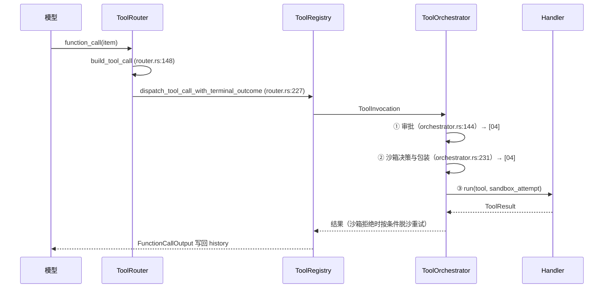

# 03 · 工具系统（Tools）

> TL;DR：工具是模型影响真实世界的唯一手段。本页讲工具**清单、注册条件、调用流水线**，并深写两个核心工具：`apply_patch`（改文件）与 `exec_command`（跑命令）。配套：[04-approvals-sandbox](./04-approvals-sandbox.md)（审批+沙箱）。

---

## 1. 工具全景

Handler 定义在 `core/src/tools/handlers/`（`mod.rs:55` re-export），每个 handler `impl ToolExecutor<ToolInvocation>` 返回 `tool_name()`。主要工具：

| 工具名 | handler | 作用 |
|---|---|---|
| `exec_command` | `handlers/unified_exec/exec_command.rs:83` | 在（沙箱）PTY 中跑命令 |
| `write_stdin` | `handlers/unified_exec/write_stdin.rs:34` | 向后台进程 stdin 写数据 / 轮询 |
| `apply_patch` | `handlers/apply_patch.rs:352` | 应用补丁改文件（**freeform**，非 JSON） |
| `update_plan` | `handlers/plan.rs:49` | 任务清单（plan mode 内禁用） |
| `request_permissions` | `handlers/request_permissions.rs:29` | 模型主动申请额外权限 |
| `request_user_input` | `handlers/request_user_input.rs:26` | 向用户提问（实验性） |
| `view_image` | `handlers/view_image.rs:72` | 读图（输出 data URL） |
| `clock.curr_time` / `clock.sleep` | `handlers/current_time.rs:22` / `sleep.rs:24` | 时间/睡眠 |
| `get_context_remaining` / `new_context_window` | `handlers/get_context_remaining.rs:63` / `new_context_window.rs:20` | token 预算管理 |
| `wait_agent` 等 | `handlers/multi_agents_v2/*.rs` | 多 agent（[05-multi-agent](./05-multi-agent.md)） |
| `mcp__<server>__<tool>` | `handlers/mcp.rs:43` | MCP 工具（动态注册） |
| `web.run` / `tool_search` 等 | 扩展/动态工具 | 条件注册 |

## 2. 注册与条件（模型能看到哪些工具）

注册总入口 `spec_plan.rs:117` `build_tool_router`。关键条件注册（`spec_plan.rs:1022` `add_core_utility_tools`）：

| 工具 | 注册条件 |
|---|---|
| `exec_command` + `write_stdin` | `Feature::ShellTool` + `Feature::UnifiedExec` + `model_info.shell_type != Disabled`（`spec_plan.rs:970`） |
| `apply_patch` | `model_info.apply_patch_tool_type.is_some()`（模型支持）且环境存在 |
| `request_permissions` | `Feature::RequestPermissionsTool`（`features/src/lib.rs:137`） |
| `update_plan` | `config.update_plan_enabled` |
| `view_image` | `Feature::ViewImage` |
| `wait_agent` 等 | 多 agent 版本开关（[05-multi-agent](./05-multi-agent.md)） |
| MCP 工具 | `mcp.has_servers()` |

**模型可见性**：`build_model_visible_specs`（`spec_plan.rs:483`）只把 `exposure.is_direct()` 的工具 spec 发给模型；同 namespace 工具合并（`merge_into_namespaces`）。

## 3. 调用流水线（一次工具调用的旅程）



| 环节 | 代码位置 | 作用 |
|---|---|---|
| 判定工具调用 | `stream_events_utils.rs:289` `handle_output_item_done` | 区分工具/消息 |
| 构造 ToolCall | `tools/router.rs:148` `build_tool_call` | `FunctionCall`/`CustomToolCall`/`ToolSearchCall` 归一化 |
| 分发 | `router.rs:227` → `registry.rs:479` `dispatch_any_with_terminal_outcome` | 定位 handler |
| 编排 | `tools/orchestrator.rs:56` `run_attempt`（审批→沙箱→执行三阶段） | 「审批 → 尝试 → 失败降级」 |
| 并行 | `tools/parallel.rs:73` `ToolCallRuntime::handle_tool_call` | turn 内多工具异步执行（`in_flight`） |

## 4. 核心机制深写：apply_patch（改文件的工具）

### 是什么

`apply_patch` 是一个 **FREEFORM 工具**（不是 JSON function call）：模型输出一段有严格语法的补丁文本，handler 解析、验证、应用到工作树。语法（`handlers/apply_patch.lark`）：

```text
*** Begin Patch
*** Update File: src/main.rs
@@
-fn old() {}
+fn new() {}
*** End Patch
```

### 为什么

改文件如果用「读→改→写」三步，每个文件要 2-3 轮工具往返；apply_patch 让模型**一次输出多个文件的完整补丁**，一轮应用完毕。且 Codex 把它**嵌入 shell 命令拦截**（见下），兼容 `apply_patch <<'EOF'` 的既有习惯。

### 证据（双层实现）

**第一层：独立 crate** `codex-rs/apply-patch/`（纯解析/验证/应用引擎）：
- `invocation.rs:113` `maybe_parse_apply_patch`：识别 `[cmd, body]` 直传与 `cd <path> && apply_patch <<'EOF'` heredoc 两种形态（tree-sitter bash 提取）。
- `invocation.rs:160` `maybe_parse_apply_patch_verified_with_mode` → `MaybeApplyPatchVerified::{Body, ShellParseError, CorrectnessError, NotApplyPatch}`。
- `invocation.rs:214` `try_verify_apply_patch_args`：逐 hunk 验证路径、读文件、检查权限。

**第二层：core 集成** `core/src/tools/handlers/apply_patch.rs`：
- `handle_call`（`:365`）→ `parse_patch` → `verify_apply_patch_args_with_mode` → `execute_verified_patch`。
- **shell 命令拦截**（`:508` `intercept_apply_patch`）：`exec_command.rs:321-354` 在命令执行前拦截形如 `apply_patch <<'EOF'` 的命令——命中则**不再跑真实 shell**，直接应用补丁：

```rust
let intercepted_patch = intercept_apply_patch(&command, &cwd, ...).await;
if let Some(output) = intercepted_patch? {
    manager.release_process_id(process_id).await;
    return Ok(boxed_tool_output(...));   // 直接返回工具输出
}
```

### 边界与反例

- **只处理文本文件**：二进制（非法 UTF-8）读取失败（测试 `apply-patch/src/invocation.rs:982` `test_unreadable_destinations_still_verify`）。
- **安全评估**：`core/src/apply_patch.rs:22` `prepare_apply_patch` → `assess_patch_safety` 三态：`AutoApprove` / `AskUser`（转 `NeedsApproval`）/ `Reject`；写权限推导 `write_permissions_for_paths`（`:236`，非工作区路径需额外审批）。
- **隐式裸 patch 拒绝**：命令本身就是补丁但缺 `apply_patch` 前缀 → `CorrectnessError(ImplicitInvocation)`（`invocation.rs:169-178`）。
- **Plan mode 内禁用 update_plan**（`plan.rs:84`）——update_plan 是清单工具，与 Plan 协作模式是两回事。

## 5. 核心机制深写：exec_command（跑命令的工具）

### 是什么

`exec_command` 在 PTY 中执行命令，返回输出或 `session_id`（长任务转后台）。spec 描述（`shell_spec.rs`）：

```rust
description: "Runs a command in a PTY, returning output or a session ID for ongoing interaction."
```

### 为什么

agent 的「动手能力」主要靠它；PTY 语义让交互式命令（如确认提示）也能工作；`yield_time_ms` 到期后命令转后台（返回 `session_id`），模型用 `write_stdin` 轮询/喂输入——避免长命令阻塞整个 turn。

### 证据

```rust
// handlers/unified_exec/exec_command.rs:82-96
impl ToolExecutor<ToolInvocation> for ExecCommandHandler {
    fn tool_name(&self) -> ToolName { ToolName::plain("exec_command") }
    fn supports_parallel_tool_calls(&self) -> bool { true }
}
```

参数 schema（`shell_spec.rs:21`）：`cmd`（必填）、`workdir`、`tty`、`yield_time_ms`（默认 10000ms）、`max_output_tokens`；条件参数 `shell`/`login`/`environment_id`。

关键行为：
- **cwd**：`workdir` 缺省用 `turn_environment.cwd()`（`exec_command.rs:150-158`）。
- **shell 解析**：`unified_exec.rs:97` `get_command`——`Direct` 模式用 `shell.derive_exec_args`；远程环境强制 Direct。
- **env 策略**：`shell_environment_policy` 控制（`process_manager.rs:1245`）。
- **hooks 视角**：`pre_tool_use_payload`（`exec_command.rs:421`）给 hooks 的工具名固定为 `"bash"`，输入为 `{"command": args.cmd}`；hook 返回 `updatedInput.command` 可改写命令（`:434`）。
- **策略拒绝**：escalated 沙箱请求下 `prompt_is_rejected_by_policy`（`core/src/exec_policy.rs:214`）——`Never` 一律拒绝、`Granular` 分类型（[04-approvals-sandbox](./04-approvals-sandbox.md)）。

### 边界与反例

- **后台轮询**：`write_stdin` 空写入 = background poll（`write_stdin.rs:101`），不重复触发 pre-hook。
- **execpolicy 脱沙前提**：命令想绕过沙箱必须每个解析段都有显式 allow 规则（[04-approvals-sandbox](./04-approvals-sandbox.md)）。

## 一句话总结

工具系统是「模型 ↔ 世界」的网关：router 解析、registry 按条件注册、orchestrator 编排（审批→沙箱→执行→重试）、handler 落地；`apply_patch` 用 freeform 语法一轮改多文件并拦截 shell 命令，`exec_command` 用 PTY+后台会话支撑长任务。

## 下一步

- 审批与沙箱如何约束工具 → [04-approvals-sandbox](./04-approvals-sandbox.md)
- 多 agent 工具（spawn_agent/wait_agent） → [05-multi-agent](./05-multi-agent.md)
