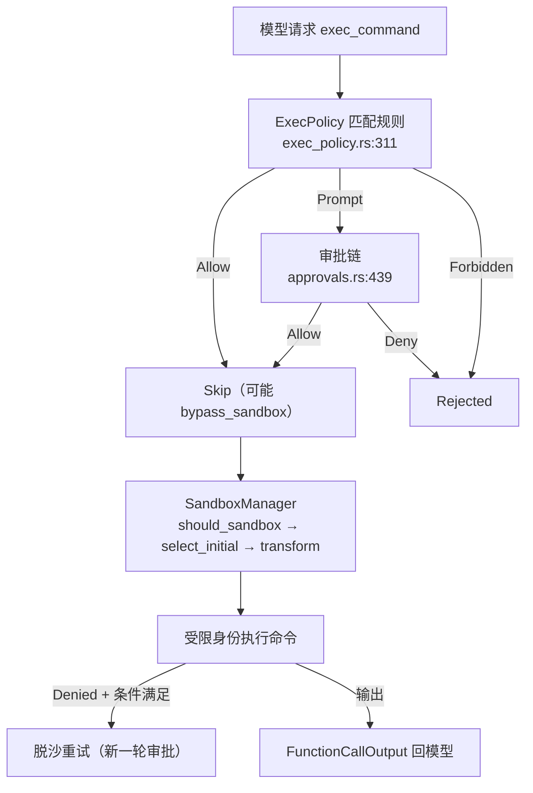

# 04 · 审批与沙箱（Approvals & Sandboxing）

> TL;DR：agent 每次执行命令/改文件前有两道闸：**execpolicy/审批决定「能不能做」**，**沙箱决定「以什么受限身份做」**。本页讲审批链、沙箱三态、`SandboxManager`，以及它们的协同。配套：[03-tools](./03-tools.md)（触发点）。

---

## 1. 两道闸的职责边界

| 闸 | 负责 | 代码 |
|---|---|---|
| **ExecPolicy 规则** | 用规则文件预设命令命运（allow/prompt/forbidden） | `core/src/exec_policy.rs` + `codex-rs/execpolicy`（纯引擎） |
| **审批链** | 需要批准时由谁裁决（hooks → Guardian → 用户） | `core/src/tools/approvals.rs` |
| **沙箱** | 把权限策略编译成 OS 强制（受限身份执行） | `codex-rs/sandboxing/src/manager.rs` |
| **编排** | 在工具执行时串起「审批 → 沙箱 → 执行 → 重试」 | `core/src/tools/orchestrator.rs:56` |

一句话：**execpolicy/审批是「决策」，沙箱是「执行时的强制」**；`danger-full-access` 无沙箱 ≠ 无审批。

## 2. 审批：谁在什么时机裁决

### 触发点

`ToolOrchestrator::run` 的 Approval 阶段（[orchestrator.rs:144](../codex-rs/core/src/tools/orchestrator.rs)）：工具先算出 `ExecApprovalRequirement` 三态：

```rust
// core/src/tools/sandboxing.rs:152
pub(crate) enum ExecApprovalRequirement {
    Skip { bypass_sandbox: bool, proposed_execpolicy_amendment: Option<ExecPolicyAmendment> },
    NeedsApproval { reason: Option<String>, proposed_execpolicy_amendment: Option<ExecPolicyAmendment> },
    Forbidden { reason: String },
}
```

- `Skip` → 直接执行（`bypass_sandbox=true` 时首次尝试可脱沙）。
- `Forbidden` → `ToolError::Rejected`，模型收到错误。
- `NeedsApproval` → 走审批链。

### 决策优先级链（唯一详述处）

`request_approval`（[approvals.rs:439](../codex-rs/core/src/tools/approvals.rs)）：

```rust
let resolution = match run_permission_request_hooks(self, ...).await {
    Some(PermissionRequestDecision::Allow) => /* Hook 批准 */
    Some(PermissionRequestDecision::Deny { message }) => /* Hook 拒绝 */
    None => self.request_reviewer_approval(action, &ctx).await,  // → Guardian 或 用户
};
```

```mermaid
flowchart LR
    A["NeedsApproval"] --> H["hooks (PermissionRequest)"]
    H -->|允许| OK["Approved"]
    H -->|拒绝| NO["Denied"]
    H -->|无 hook| G["Guardian / strict-auto-review"]
    G -->|可裁决| OK
    G -->|需人| U["用户弹窗"]
    U --> OK / NO / ABORT
```

| 环节 | 代码位置 | 作用 |
|---|---|---|
| 三态分流 | `orchestrator.rs:169-229` | Skip/Forbidden/NeedsApproval |
| hooks 裁决 | `hook_runtime.rs:237` `run_permission_request_hooks` | 先问 hooks |
| 结果翻译 | `approvals.rs:407` `into_tool_result`：Denied→`ToolError::Rejected`、Abort→`TurnAborted` | 语义统一 |
| 用户弹窗 | `approvals.rs:610` `request_user_approval`（含会话级缓存 `ApprovalCacheKey`） | 最终裁决 |

### 何时需要批准（approval_policy）

`AskForApproval`（[protocol/src/protocol.rs:924](../codex-rs/protocol/src/protocol.rs)）：

| 值 | 语义 |
|---|---|
| `untrusted`（UnlessTrusted） | 不可信项目：除非 execpolicy 显式 allow，否则全要批准 |
| `on-request`（OnRequest，默认） | 模型决定；受限沙箱内才需批准（`tools/sandboxing.rs:194` `default_exec_approval_requirement`） |
| `granular`（Granular(config)） | 按类别：true 放行 / false 自动拒绝（不弹窗） |
| `never` | 永不询问；该弹的转 `Forbidden`（`exec_policy.rs:214` `prompt_is_rejected_by_policy`） |

## 3. 核心机制深写：ExecPolicy 如何参与 agent 命令决策

### 是什么

命令执行前，`ExecPolicyManager::create_exec_approval_requirement_for_command`（[core/src/exec_policy.rs:311](../codex-rs/core/src/exec_policy.rs)）用规则库匹配命令，把 `Decision` 翻译成工具层三态。规则是 Starlark DSL：

```python
# 示例（execpolicy/examples/example.codexpolicy）
prefix_rule(
    pattern = ["git", "reset", "--hard"],
    decision = "forbidden",
    justification = "destructive operation",
    match = [["git", "reset", "--hard"]],
)
```

`Decision` 三态（`execpolicy/src/decision.rs:9`）：`Allow` / `Prompt` / `Forbidden`。

### 为什么

「预设规则 + 增量追加」让 agent 越用越顺手：用户批准过的命令会以 `prefix_rule(decision="allow")` 追加进规则文件（`exec_policy.rs:443` `append_amendment_and_update` + `execpolicy/src/amend.rs` `blocking_append_allow_prefix_rule`），下次同类命令直接放行。

### 证据（Decision → ExecApprovalRequirement 映射）

```rust
Decision::Forbidden => ExecApprovalRequirement::Forbidden { ... },
Decision::Prompt => ExecApprovalRequirement::NeedsApproval { ... },
Decision::Allow => ExecApprovalRequirement::Skip {
    bypass_sandbox: commands.iter().all(|command| /* 每个解析段都有显式 allow */),
    ...
},
```

**安全底线**：`bypass_sandbox: true` 仅在命令**每个解析段都被显式 allow** 时成立——heredoc 内脚本即使内部有 allow 规则也留在沙箱（测试 `exec_policy_tests.rs::heredoc_script_stays_in_sandbox_despite_inner_allow_rule`）。

### 边界与反例

- **未命中规则**：`render_decision_for_unmatched_command`（`exec_policy.rs:731`）——危险命令或 Windows 无后端 → Prompt/Forbidden；`Never` + 受限沙箱内非升级请求 → Allow（依赖沙箱保护）。
- **cyber 模型忽略 allow 规则**：`exec_policy/model_policy.rs` 对 cyber 模型过滤 `Allow` 规则，仍触发审批。
- **规则热更新**：追加后 `ArcSwap<Policy>` 热更新，无需重启（`exec_policy.rs:443`）。

## 4. 核心机制深写：SandboxManager（编译权限为 OS 强制）

### 是什么

`SandboxManager`（[sandboxing/src/manager.rs:310](../codex-rs/sandboxing/src/manager.rs)）三步：`should_sandbox`（要不要）→ `select_initial`（选平台）→ `transform`（生成 wrapper argv）。

```rust
// manager.rs:310 —— 决策
match pref {
    SandboxablePreference::Forbid => false,
    SandboxablePreference::Require => true,
    SandboxablePreference::Auto => {
        let (file_system_policy, network_policy) = permission_profile.to_runtime_permissions();
        should_require_platform_sandbox(&file_system_policy, network_policy, has_managed_network_requirements)
    }
}
```

### 为什么

权限策略（PermissionProfile）必须变成 OS 能强制的东西：macOS 编译成 SBPL 文本交给 `/usr/bin/sandbox-exec`；Linux 序列化成 JSON 交给 `codex-linux-sandbox`（bubblewrap+landlock+seccomp）；Windows 用受限令牌后端。**不经过沙箱，策略限制（尤其 denied-read）可被绕过**——所以 `Auto` 下一旦策略含限制就必须进沙箱（`tools/sandboxing.rs:275` `unsandboxed_execution_allowed` 的注释点明）。

### 证据（三平台）

| 平台 | 机制 | 关键位置 |
|---|---|---|
| macOS | Seatbelt SBPL → `/usr/bin/sandbox-exec -p <policy> -DKEY=value -- <cmd>` | `seatbelt.rs:844` `create_seatbelt_command_args_with_profile`；绝对路径防 PATH 注入（`:56`） |
| Linux | `codex-linux-sandbox --permission-profile <json> ... -- <cmd>`；系统 bwrap 只做可用性探测 | `landlock.rs:23`；`bwrap.rs:168`；`exec/src/main.rs:28`（arg0 双身份） |
| Windows | 受限令牌（RestrictedToken）/ 提权（Elevated）双后端；能力不足拒绝裸跑 | `windows.rs:96` 「refusing to run unsandboxed」；`spawn.rs:42` |

### 沙箱三态档位（配置形态）

`SandboxMode`（[protocol/src/config_types.rs:104](../codex-rs/protocol/src/config_types.rs)）：`read-only`（默认）/ `workspace-write` / `danger-full-access`。运行时实际档位由权限策略推导（`core/src/sandbox_tags.rs:40` `permission_profile_policy_tag`）：

```rust
if file_system_policy.has_full_disk_write_access() { "danger-full-access" }
else if !file_system_policy.has_writable_roots_with_cwd(cwd) { "read-only" }
else { "workspace-write" }
```

### 边界与反例

- **managed network**：网络受限时 `should_require_platform_sandbox` 恒 true（`policy_transforms.rs:541`）——网络代理必须在沙箱进程内实现。
- **脱沙重试**：沙箱内被 `SandboxErr::Denied` 拒绝后，仅当「工具支持 escalate + `unsandboxed_allowed` + 策略允许 + 重试通过新一轮审批」才脱沙重试一次（`orchestrator.rs:320-420`）。
- **metadata 保护**：`.git`/`.codex` 等在工作区可写根内也禁止首建/替换（`seatbelt.rs:578`，测试 `seatbelt_prevents_writable_root_replacement`）。

## 5. 协同全景（一次 shell 命令的完整关卡）



## 一句话总结

agent 动手前过四关：execpolicy 规则（预设命运）→ 审批链（hooks→Guardian→用户）→ 沙箱（编译权限为 OS 强制）→ 执行；`Allow` 想免沙箱必须全段显式规则，沙箱被拒想脱沙必须新一轮审批——每一关都不存在「静默放行」。

## 下一步

- 这些关卡在工具流水线中的位置 → [03-tools](./03-tools.md)
- 沙箱内的多 agent 协作 → [05-multi-agent](./05-multi-agent.md)
