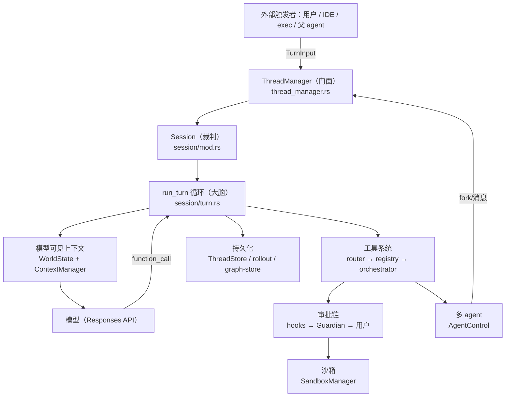

# Codex Agent 学习文档

> TL;DR：本套文档只讲 **Codex 的 agent 本体**——turn 循环、模型可见上下文、工具、审批与沙箱、多 agent、会话生命周期。读完 README 你能复述一条主线：什么事件触发 agent、谁指挥谁、一次完整任务怎么走。建议先读 [01-agent-loop](./01-agent-loop.md)。

**一句话**：Codex agent 是一个**自主执行任务的循环**——用户给一句话目标，它反复「把历史发给模型 → 模型请求工具 → 审批+沙箱执行工具 → 结果写回历史」直到完成；它还能 fork 出子 agent 并行干活。

---

## 快速导航

| 主题 | 文档 |
|---|---|
| turn 主循环（run_turn 深写） | [01-agent-loop](./01-agent-loop.md) |
| 模型可见上下文（WorldState/fragment/history） | [02-context-prompt](./02-context-prompt.md) |
| 工具系统（注册/路由/apply_patch/shell） | [03-tools](./03-tools.md) |
| 审批与沙箱（谁放行、以什么身份跑） | [04-approvals-sandbox](./04-approvals-sandbox.md) |
| 多 agent（fork/通信/协作模式） | [05-multi-agent](./05-multi-agent.md) |
| 会话生命周期（ThreadManager/resume/落盘） | [06-session-persistence](./06-session-persistence.md) |

> 源码根：`codex-rs/core/src/`（核心）、`codex-rs/sandboxing/`（沙箱）、`codex-rs/execpolicy/`（规则引擎）、`codex-rs/agent-*/`（多 agent 支持 crate）。

---

## 逻辑架构图

---

## 一条主线（全景叙事）

### ① 何时被调用：入口点全景

| 谁调用 | 何时 | 调用什么 | 返回 | 频率 |
|---|---|---|---|---|
| 用户在 TUI/exec/IDE 发消息 | 每次任务 | `TurnInput` → `run_turn` | 最终消息/事件流 | 每次触发 |
| `codex resume` | 恢复会话 | `ThreadManager::resume_thread_from_rollout` | 会话继续 | 每次触发 |
| 父 agent spawn | 需要并行/分工 | `AgentControl::spawn_agent` → 新 Session | 子代理 thread | 每次触发 |
| 父 agent 发消息/等待 | 协作中 | `InterAgentCommunication` / `wait_agent` 工具 | 子代理回复 | 每次触发 |
| 模型请求工具 | turn 循环内 | `ToolRouter` → `ToolOrchestrator` | 工具输出 | 每轮采样多次 |
| 用户批准/拒绝 | 审批触发时 | `request_approval` | Allow/Deny/Abort | 每次触发 |

**生命周期**：Session 是进程级（每个线程一个，app-server 存活期间存在）；TurnContext 是 turn 级；StepContext 是采样请求级；子代理是独立的 Session/线程，与父共享同一个 `AgentControl`（[05-multi-agent](./05-multi-agent.md)）。

### ② 主要工作角色

- **门面**：`ThreadManager`（[thread_manager.rs:906](../codex-rs/core/src/thread_manager.rs)）——所有「新建/恢复/fork 线程」请求的入口。
- **裁判**：`Session` + `run_turn`（[turn.rs:153](../codex-rs/core/src/session/turn.rs)）——决定每轮发什么、收什么、是否继续。
- **大脑**：模型（Responses API），全程唯一的决策者。
- **执行者**：工具系统（router→registry→orchestrator→handler），在审批+沙箱约束下落地。
- **审批者**：hooks → Guardian → 用户（[04-approvals-sandbox](./04-approvals-sandbox.md)）。
- **调度者**：`AgentControl`（多 agent 场景），负责 fork、限额、通信（[05-multi-agent](./05-multi-agent.md)）。

### ③ 主要工作流程（端到端旅程）

用户想「修复 bug」：

1. 输入 → `ThreadManager.start_thread` → `Session::spawn` → `submission_loop`（[06-session-persistence](./06-session-persistence.md)）。
2. `run_turn` 启动：组装模型可见上下文（WorldState 渲染 + history 裁剪，[02-context-prompt](./02-context-prompt.md)）→ 调 Responses API。
3. 模型返回工具调用 → `ToolRouter` 转 `ToolCall` → `ToolOrchestrator` 走「审批 → 沙箱 → 执行」（[03-tools](./03-tools.md) + [04-approvals-sandbox](./04-approvals-sandbox.md)）。
4. 工具输出以 `FunctionCallOutput` 写回 history → 下一轮采样把结果喂回模型。
5. 循环直到模型给出最终消息 → turn 结束、落盘。
6. 若模型觉得需要帮手 → `spawn_agent` 创建子代理并行干活，通过邮箱收发消息、`wait_agent` 等待（[05-multi-agent](./05-multi-agent.md)）。

完整带代码位置的时序见 [01-agent-loop](./01-agent-loop.md) 与 [05-multi-agent](./05-multi-agent.md)。

---

## 核心概念 → 主文档（单一事实来源）

> 每个概念**只详述一次**，其余文档一律链接。本表是写作时维护的映射：

| 概念 | 唯一主文档 |
|---|---|
| turn 主循环 / run_turn / 采样循环 | [01-agent-loop](./01-agent-loop.md) |
| WorldState sections / fragment trait / history / 6 条上下文约束 | [02-context-prompt](./02-context-prompt.md) |
| 工具注册 / 路由 / apply_patch / exec_command | [03-tools](./03-tools.md) |
| 审批链 / 沙箱三态 / SandboxManager / execpolicy 协同 | [04-approvals-sandbox](./04-approvals-sandbox.md) |
| AgentControl / fork / 邮箱通信 / wait_agent / V1/V2 | [05-multi-agent](./05-multi-agent.md) |
| ThreadManager / rollout / resume / graph-store | [06-session-persistence](./06-session-persistence.md) |
